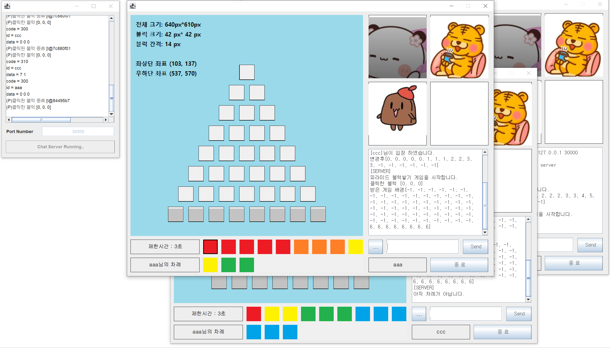
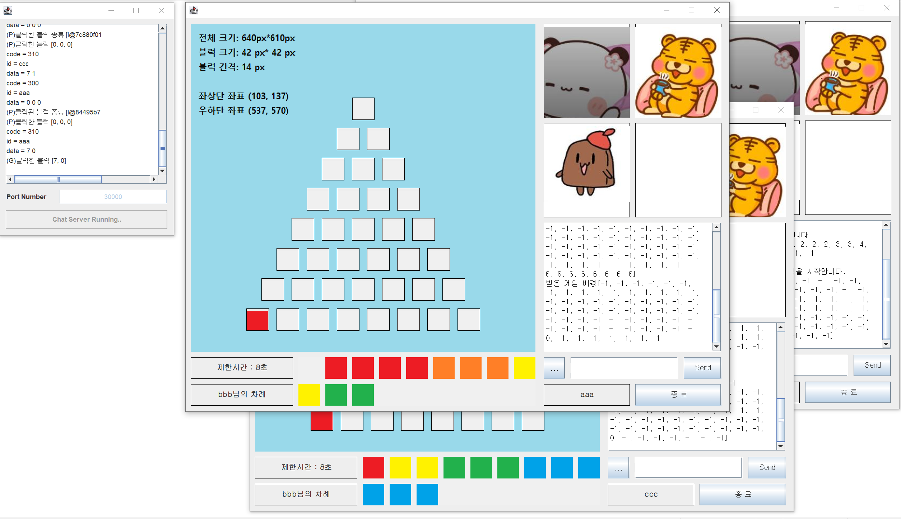
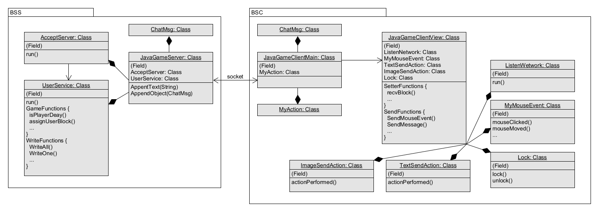

# [피라미드 블록 쌓기] : Java Socket Project
Java의 Swing, Socket, Thread를 활용한 3~4인 로컬 서버 멀티플레이 2D 게임

<br>

## 개발 기간: 
2021.10. ~ 2021.12. (2주)  

<br>

## 참여 인원: 2인
- 김우성: 백앤드 개발
- 손성한: 프론트앤드 개발

<br>

## 기술 스택
- IDE: Eclipse 2019-12
- Java Version: JDK 14
- OS: Windows 7
- API
  - Java Swing
  - Java Socket
  - Java Thread
  - Java Lock

<br>

## 게임 이미지 (추가 이미지: ./Demon 참조)



### [[시연연상(소리O)](Demon/시연연상소리(O).mp4)]

<br>

## 시스템 구성도

### [[UXF](Demon/PyramidBlockStack_UML.uxf)]

<br>

## 프로토콜
- 공통 프로토콜  

|Protocol|용도/내용|방향|
|:----------:|:--------------------:|:--------------------:|  
|100|로그인|Client -> Server|
|120|유저 이미지 표시|Server -> Client -> Server|
|150|새로운 유저 이미지 표시|Server -> Client -> Server|
|170|타이머 시간|Server -> Client|
|171|타이머 이미지|Server -> Client|
|200|채팅 메시지|Client -> Server -> Client|
|400|로그아웃|Client -> Server|
|500|마우스 이벤트|Client -> Server -> Client|

- 게임 진행 관련 프로토콜 
  
|Protocol|용도/내용|방향|
|:----------:|:--------------------:|:--------------------:|  
|300|유저가 가진 블록 클릭|Client -> Server|
|301|유저가 가진 블록 클릭 확인|Server -> Client|
|302|블록을 놓을 수 있는 위치 전달|Server -> Client|
|310|게임화면 블록 클릭|Client -> Server|
|311|게임화면 블록 클릭 확인|Server -> Client|
|321|유저가 가진 블록 갱신|Server -> Client|
|350|잘못된 위치 클릭 이벤트|Server -> Client|
|351|아직 차례가 아님 경고|Server -> Client|
|360|3명 입장 필요 경고|Server -> Client|
|370|게임 시작 알림|Server -> Client|
|371|유저 블록 할당|Server -> Client|
|380|게임 끝| Server->Client|

<br>

## 주요 코드

- ### Socket을 통한 Server와 Client 연결
```Java
/******************************************************************************
* JavaGameServer.java
*   line 123 ~ 142 
*
* JavaGameClientView.java
*   line 248 ~ 289 
******************************************************************************/

public class JavaGameServer extends JFrame {
    class AcceptServer extends Thread {
        @SuppressWarnings("unchecked")
        public void run() {
            while (true) {
                try {
                    AppendText("Waiting new cliends ...");
                    // Client에서 Socket 생성하여 accept()가 일어나기 전까지 대기. 
                    client_socket = socket.accept(); 
                    AppendText("새로운 참가자 이름 from " + cliend_socket);
                    /* 
                        ~ UserService 생성 및 유저 풀 Vector에 추가 ~
                    */
                }
                catch (IOException e) {
                    /* ~ 연결 실패 처리 ~ */
                }
            }
        }
    }
}

public class JavaGameClientView extends JFrame {
    public JavaGameClientView(String username, String ip_addr, String port_no) {
        /* 
            ~ Contructing ~
        */
        try {
            // AcceptServer의 accept() 호출
            socket = new Socket(ip_addr, Integer.parseInt(port_no));
            /*
                ~ 입출력 스트림 생성, 버튼 액션 바인딩 ~
            */
        } catch (NumberFormatException | IOException e) { }
    }
}
```


- ### ChatMsg 클래스를 컨테이너로 이용, 프로토콜에 의한 Server-Client 통신
```Java
/******************************************************************************
* JavaGameServer.java
*   line 162 ~ 314
******************************************************************************/

public class JavaGameServer extends JFrame {
    class UserService extends Thread {
        public void run() {
            while (true) {
                Obejct obcm = null;
                String msg = null;
                ChatMsg cm = null;
                
                try {
                    // JavaGameClientView의 writeObject()에 의해 호출
                    obcm = ois.readObject();
                } catch (ClassNotFoundException e) { }

                if (obcm != null && obcm instanceof ChatMsg) {
                    /*
                        ~ 입력받은 객체가 정상이라면 프로토콜에 따른 수행 ~
                    */
                }
            }

            switch (cm.code) [
                case "100": // 유저 로그인 
                    
                case "200": // 일반 채팅 메시지

                case "300": // 유저가 가진 블록 클릭 이벤트

                /*
                    ~ 이외 프로토콜의 기능 정의 ~
                */
                default: 
            ]
        }
    }
}
```


- ### synchronized 키워드를 이용한 멀티스레딩 환경에서의 동기화
``` Java
/******************************************************************************
* JavaGameClientView.java
*   line 411 ~ 505
******************************************************************************/
public class javaGameClientView extends JFrame {
    // 특정 코드 부분에 대한 접근 통제
    class Lock {
        private boolean isLocked = false;
        public synchronized void lock() thorws InterruptedException {
            while (isLocked) {
                wait();
            }
            isLocked = true;
        }
        public synchronized void unlock() {
            isLocked = false;
            notify();
        }
    }

    // Protocol "302", "311"에서 Lock() 사용
    class ListenNetwork extends Thread {
        public void run() {
            while (true) {
                /* 
                    ~ readObject 후 프로토콜 처리 ~
                */ 
                switch (cm.code) {
                    /*
                        ~ 기타 프로토콜 ~
                    */
                    case "302": 
                    // 현재 가진 블럭 클릭할 때, 블럭을 놓을 수 있는 위치가 반영된 게임 배경 수신 -> lock() 사용으로, 연속으로 클릭해도 수신되지 않음
                        /*  
                            ~ 수신한 블럭 정보 가공 ~
                        */
                        try {
                            lock.lock();
                        } catch (InterrutedException e) {}
                        /*
                           ~ panel의 모양을 변경 ~
                        */
                       lock.unlock();

                    break;
                    /*
                        ~ 기타 프로토콜 ~
                    */
                }
            }
        }
    }
}
```
<br>

## 비고
- 모든 try-catch문의 예외 상황에서 프로그램 종료나 연결 해제하고 있음. 일정 횟수까지 시도하는 방법으로 개선 필요
- 각 유저의 채팅에 캐릭터 이미지를 넣는 기능, 이미지를 축소시켜 채팅창으로 전달하는 기능 미구현
- 채팅 메시지 길이 제한 없음. 이외에도 최악의 사용자를 고려한 설계 필요
- 게임 자동 시작이 아닌 모든 유저의 동의에 의한 시작, 게임 재시작 등의 게임 기능 미흡